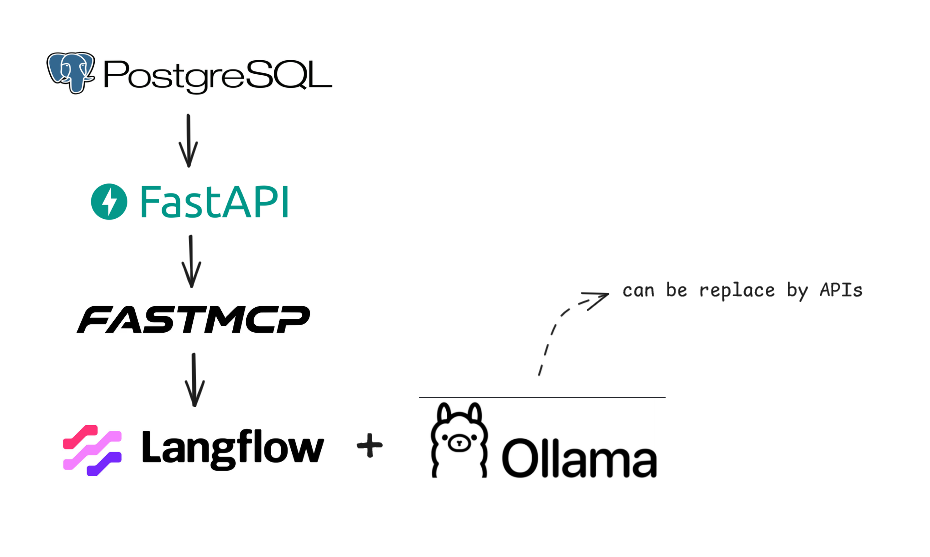

# Procurement Tracking API + MCP Server

This repository contains a small procurement tracking platform built around three main pieces:

- a PostgreSQL database seeded with sample procurement data
- a FastAPI backend for packages, PSR tracking, timelines, and analytics
- a FastMCP server that exposes selected backend capabilities as MCP tools

Langflow is also included in Docker Compose as an optional visual layer for experimenting with flows that consume the API and MCP services.

Another option for testing is Claude Desktop configured to connect to the MCP server.

Example `claude_desktop_config.json`:

```
{
  "preferences": {
    "coworkWebSearchEnabled": true,
    "coworkScheduledTasksEnabled": false,
    "ccdScheduledTasksEnabled": false,
    "sidebarMode": "chat"
  },
  "mcpServers": {
    "backend-tools": {
      "command": "npx",
      "args": ["mcp-remote", "http://localhost:8002/mcp/"]
    }
  }
}
```

The stack is designed for local development with Docker Compose.



## What It Does

The backend tracks procurement packages across ordered milestones and compares planned dates against actual completion dates. On top of the CRUD-style API, it provides timeline and delay analytics that can also be accessed through the MCP server.

Main capabilities:

- manage procurement packages
- create and update PSR milestone records
- view package timelines
- analyze delayed milestones and delayed packages
- summarize delays by category, milestone, or package
- expose analytics through MCP for agent-based workflows

## Services

The root compose file starts these services:

- `postgres`: PostgreSQL with the `pgvector` image and seeded sample data
- `api`: FastAPI backend, exposed on `http://localhost:8001`
- `mcpserver`: FastMCP server, exposed on `http://localhost:8002/mcp/`
- `langflow`: optional Langflow UI, exposed on `http://localhost:7860`
- `Claude Desktop`: optional local client for testing the MCP server

## Quick Start

Run the full stack:

```bash
docker compose up --build
```

Stop it:

```bash
docker compose down
```

If you run an Ollama model locally for LLM/chat, start the model separately before using Langflow (see "Using Ollama + Langflow" below).

## Useful URLs

- Backend health: `http://localhost:8001/`
- Backend docs: `http://localhost:8001/docs`
- MCP endpoint: `http://localhost:8002/mcp/`
- Langflow: `http://localhost:7860`
- Ollama API (local): `http://localhost:11434` (use `http://host.docker.internal:11434` from Docker)

## Backend API Areas

The FastAPI app exposes these route groups:

- `/packages`: list, create, update, and deactivate packages
- `/psr`: create and update planned vs actual milestone records
- `/timeline/{package_id}`: package timeline view ordered by milestone
- `/analytics`: delay-focused reporting endpoints

The data model is centered on:

- `packages`
- `milestones`
- `psr`
- `comments`

The database initializer in `database/scripts/init.sql` creates the schema and seeds sample milestone and package data so analytics can be tested immediately.

## MCP Tools

The MCP server proxies backend endpoints as tools. The current server includes tools for:

- backend health/status
- package listing
- delayed milestones
- delayed package summaries
- delay summaries by category
- delay summaries by milestone
- delay summaries by package
- package status by `package_id`

This makes the analytics layer available to MCP-compatible clients without exposing the database directly.

## Project Structure

```text
backend/     FastAPI application and business logic
database/    database files and SQL seed script
mcpserver/   FastMCP server that wraps backend endpoints
```

## Notes

- The backend container currently runs Uvicorn with `--reload`, which is convenient for development.
- The backend uses `DATABASE_URL` from environment variables and defaults to the Compose PostgreSQL service.
- The MCP server uses the backend service URL inside Docker networking, so both services are expected to run on the same Compose network.
- Langflow is started as a Docker Compose service and can be used as a visual testing client.
- The LLM API key should be configured in the Langflow UI when needed for hosted providers.
- When using a local Ollama model you typically do not need an API key.

**Using Ollama + Langflow**

- Start an Ollama model locally and expose its HTTP API. Examples:

```
ollama serve <model-name>
# or:
ollama run --api <model-name>
```

- By default Ollama exposes its HTTP API on `http://localhost:11434`.

- If Langflow runs inside Docker, configure Langflow to reach Ollama via `http://host.docker.internal:11434` so the container can access the host's Ollama service.

- In Langflow (`http://localhost:7860`), add/configure an LLM node using the Ollama provider or the HTTP provider with:
  - Host: `http://host.docker.internal:11434` (or `http://localhost:11434` if Langflow runs on the host)
  - Model: `<model-name>`

- Once configured, use the LLM node in a Langflow chat/flow to interact with the locally served model.

- Troubleshooting:
  - If Langflow cannot reach Ollama from a container, verify Docker Desktop supports `host.docker.internal` or expose the Ollama port and update host mappings.
  - Verify the Ollama server is running and responding at `http://localhost:11434/models`.

## Alternatives if Ollama Is Not Available

If you can't run a local Ollama model, you have two convenient alternatives to power Langflow or chat integrations:

- External AI APIs (hosted providers):
  - Use Langflow's built-in connectors for providers such as OpenAI, Azure OpenAI, or other hosted APIs. Configure the provider in the Langflow UI and supply the required API key / credentials.
  - If a provider doesn't have a native connector, use Langflow's HTTP/REST LLM node and set the base URL, headers (e.g., `Authorization: Bearer <KEY>`), and model name according to the provider's HTTP API.
  - Example quick steps for OpenAI in Langflow:

```
1. Open Langflow at http://localhost:7860
2. Create a new LLM node and choose the OpenAI provider
3. Enter your `OPENAI_API_KEY` and select the model (e.g., gpt-4o)
4. Use the node in your chat/flow
```

- Claude Desktop (local client for MCP):
  - You can use Claude Desktop as a client for the MCP server included in this repo. Configure Claude Desktop to add your MCP server pointing to `http://localhost:8002/mcp/` (see the `claude_desktop_config.json` example earlier in this README).
  - This lets you drive agent-style workflows against the MCP tools without requiring a local Ollama model.

Notes:

- Hosted APIs will typically require valid credentials and may incur usage costs.
- Using the HTTP/REST LLM node in Langflow gives you flexibility to connect virtually any LLM that exposes a compatible HTTP API.
- If you want, I can add explicit example configurations for OpenAI, Azure OpenAI, or another provider — tell me which provider you prefer.